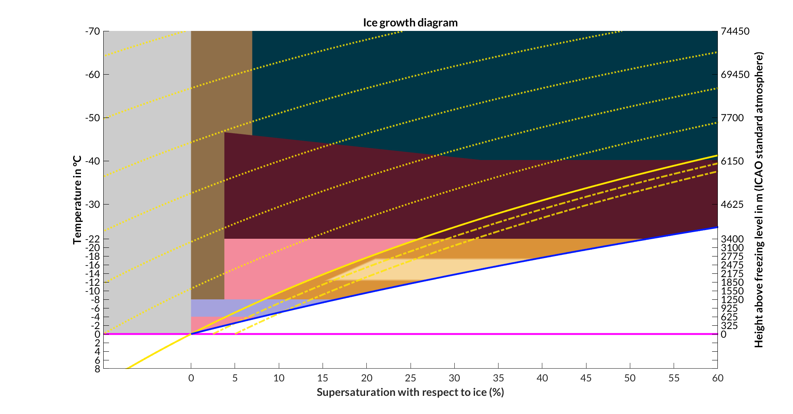
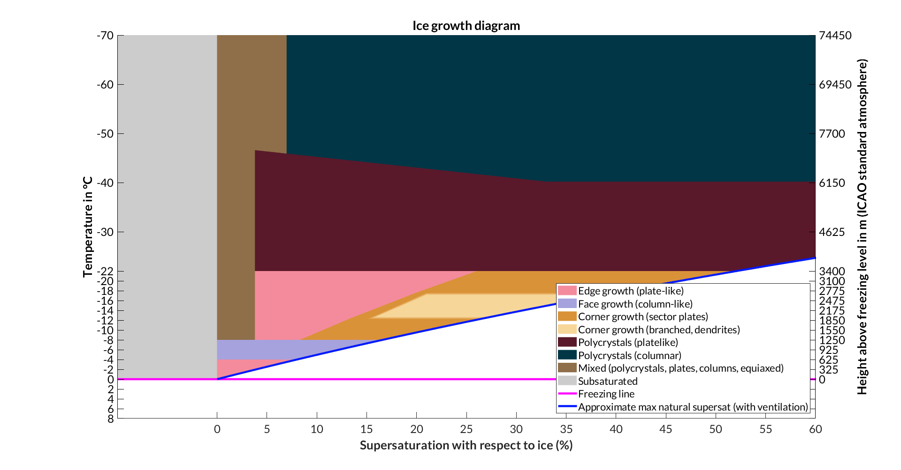

# Ice growth diagram (summer 2019)
## Introduction
Complete set of MATLAB code to make the revised ice growth diagram.

## Workflow
1. Make sure all code is in the working directory.
2. Run makeGrowthDiagramStruct
3. Run iceGrowthDiagram using the new hd variable as input
4. Success!

## Examples
### "Complete" ice growth diagram
------

**Replicate with**  
1. [hd] = makeGrowthDiagramStruct(1,1)
2. iceGrowthDiagram(hd,1,1,1,0,1)  

### No legend
------

**Replicate with**  
1. [hd] = makeGrowthDiagramStruct(1,1)
2. iceGrowthDiagram(hd,1,1,1,0,0)

### No isohumes
------

**Replicate with**  
1. [hd] = makeGrowthDiagramStruct(1,1)
2. iceGrowthDiagram(hd,1,0,1,0,1)

## Function descriptions
### Main functions
**makeGrowthDiagramStruct:** Creates a structure the information needed to plot a growth diagram. Values are derived from Bailey and Hallett 2009.  
**iceGrowthDiagram:** Plots the revised ice growth diagram.

### Required helper functions
**eswLine:** Outputs arrays useful to draw isohumes with respect to water on the diagram.  
**updraftSupersat:** Estimates maximum possible supersaturation in updraft. CAUTION: this function is still in progress.  

### Sources and Credit
------
Bailey, M.P., & Hallett, J. (2009). A comprehensive habit diagram for atmospheric ice crystals: Confirmation from the laboratory, AIRS II, and other field studies. *Journal of the Atmospheric Sciences, 66*(9), 2888-2899. doi:10.1175/2009JAS2883.1  

All code and documentation written by Daniel Hueholt, under the advisement of Dr. Sandra Yuter at North Carolina State University.  

