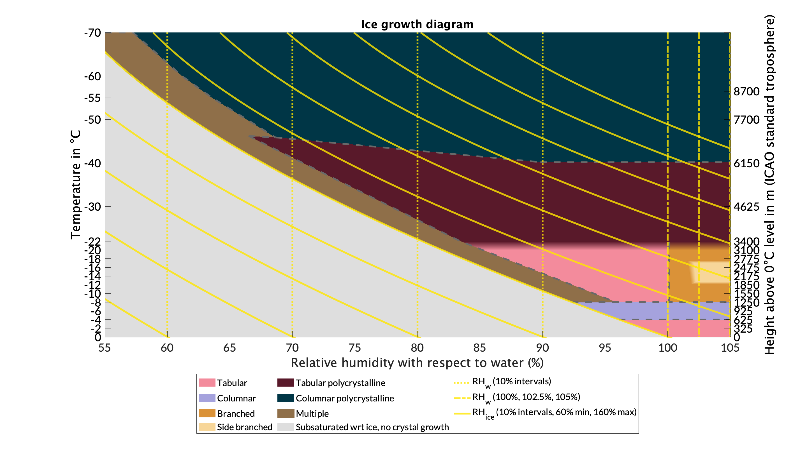
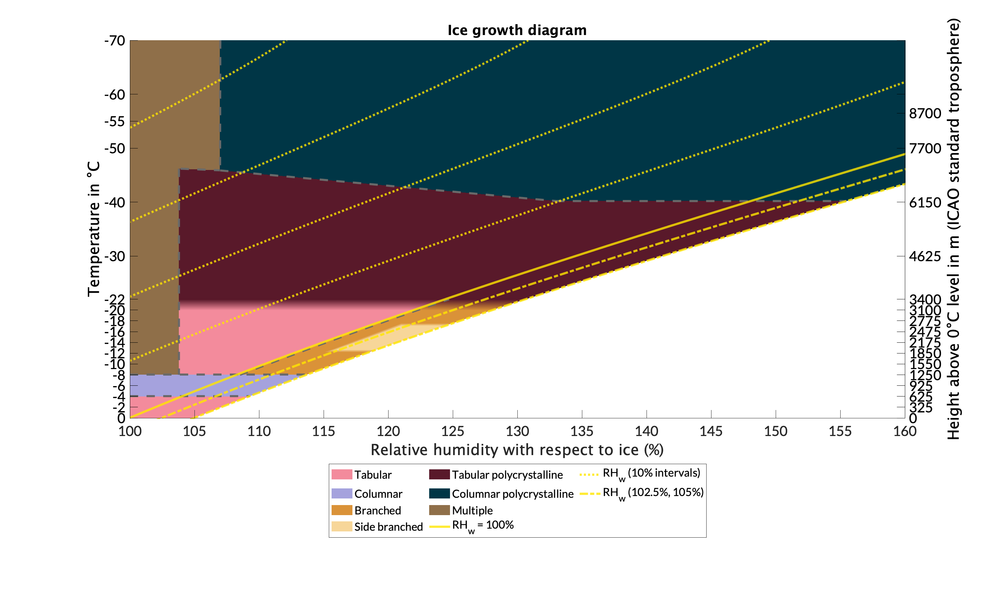
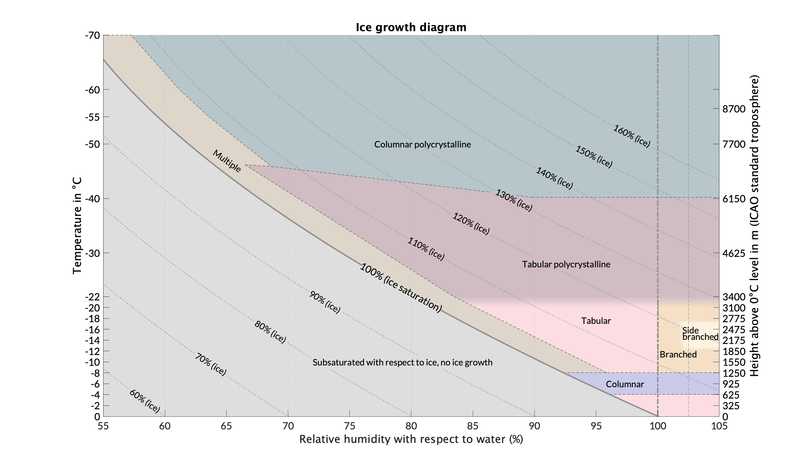
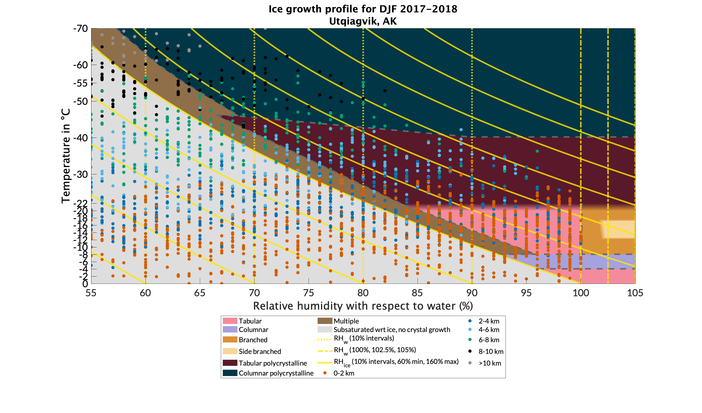

# Ice growth diagram

## Table of Contents
* [Introduction](#introduction)  
* [Basic ice diagrams](#basic-ice-diagrams)  
    * [Ice growth diagram: Relative humidity with respect to water](#ice-growth-diagram-relative-humidity-with-respect-to-water)  
    * [Ice growth diagram: Relative humidity with respect to ice](#ice-growth-diagram-relative-humidity-with-respect-to-ice)
    * [Ice growth diagram: Vapor density excess](#ice-growth-diagram-vapor-density-excess)
    * [Ice growth diagram: Relative humidity with respect to water (textbook version)](#ice-growth-diagram-relative-humidity-with-respect-to-water-textbook-edition)
* [Converting between ice supersaturation and vapor density excess](#converting-between-ice-supersaturation-and-vapor-density-excess)
* [Repository description](#repository-description)
    * [Root](#root)
    * [Helper functions](#helper-functions-subdirectory)
    * [Growth diagram profiles](#growth-diagram-profiles-subdirectory)
    * [Demo](#demo-subdirectory)
* [Growth diagram profiles](#growth-diagram-profiles)
* [Sources and credit](#sources-and-credit)

## Introduction
Complete set of MATLAB code to plot the ice growth diagram both on its own and with data. Tested and confirmed operational on MATLAB 2020a+. The ice growth diagram can be cast into three moisture variables: relative humidity with respect to water (preferred), relative humidity with respect to ice, and vapor density excess over ice saturation. There are "textbook" and "applied" versions of each ice diagram; the textbook versions are designed to be the most aesthetically-pleasing, while the applied versions are higher-contrast and suitable for data overlays.

## Basic ice diagrams
The following examples show how to make the three applied diagrams and the textbook diagram cast in terms of relative humidity with respect to water.

### Ice growth diagram: relative humidity with respect to water

This is our preferred version of the diagram. Relative humidity with respect to water is easier to understand and better represents the phase space of ice processes in the atmosphere than other moisture variables.
#### Minimal code to replicate
1. `iceGrowthDiagramWater`
The code will automatically set inputs, including the necessary basic hd structure.
#### Full code to replicate
1. `[hd] = makeGrowthDiagramStruct(1,1)`
2. `iceGrowthDiagramWater(hd,0,1,'southoutside',[55 105],[-56.5,0])`

### Ice growth diagram: relative humidity with respect to ice

For comparison to previous work, especially Bailey and Hallett (2009).
#### Minimal code to replicate
1. `iceGrowthDiagram`
The code will automatically set inputs, including the necessary basic hd structure.
#### Full code to replicate
1. `[hd] = makeGrowthDiagramStruct(1,1)`
2. `iceGrowthDiagram(hd,1,0,0,1,'southoutside',[0 0.6],[-56.5,0])`

### Ice growth diagram: vapor density excess

For comparison to previous work, especially Kobayashi (1961), Furukawa and Wettlaufer (2007), or Libbrecht (2017).
#### Minimal code to replicate
1. `iceGrowthDiagramVaporExc`
The code will automatically set inputs, including the necessary basic hd structure.
#### Full code to replicate
1. `[hd] = makeGrowthDiagramStruct(1,1)`
2. `iceGrowthDiagramVaporExc(hd,1,0,0,1,'southoutside',[0,0.351],[-56.5,0])`

### Ice growth diagram: relative humidity with respect to water (textbook edition)

This code can also be used to generate analogous images in terms of relative humidity with respect to ice or vapor density excess.
#### Code to replicate
1. `iceGrowthDiagramTextbook`
2. The code will prompt the user for a phase. Input `'water'` to obtain the diagram shown here.

## Converting between ice supersaturation and vapor density excess
Previous ice growth diagrams have reported supersaturations in either ice supersaturation (percent or decimal) or vapor density excess (g/m^3). Converting between the two units is possible, but not immediately intuitive. Currently, the revised diagram exclusively uses the ice supersaturation percent unit.  
The functions iceSupersatToRH and rhow make conversions from ice supersaturation to vapor density difference possible.
### Example 
Given an ice supersaturation of 3.8% at -8 deg Celsius, what is the vapor density excess at the same temperature?  
1. [RH] = iceSupersatToRH(3.8,-8)  
  This returns RH=95.8%
2. [rhoDiff] = rhow(95.8,-8)  
  This returns rhoDiff=0.095 
  
Thus a vapor density excess of 0.095 g/m^3 corresponds to an ice supersaturation of 3.8% at -8 deg Celsius!

## Repository description
### root
`makeGrowthDiagramStruct`: Creates a structure the information needed to plot a growth diagram. Values are derived from Bailey and Hallett 2009.  
`iceGrowthDiagramWater`: Plots the ice growth diagram in terms of relative humidity with respect to water. Input options allow for control of diagram aesthetics, e.g. isohumes, ventilation, legend, etc.  
`iceGrowthDiagram`: Plots the ice growth diagram in terms of relative humidity with respect to ice. Input options allow for control of diagram aesthetics, e.g. isohumes, ventilation, legend, etc.  
`iceGrowthDiagramVaporExc`: Plots the ice growth diagram in terms of vapor density excess over ice saturation. Input options allow for control of diagram aesthetics, e.g. isohumes, ventilation, legend, etc.

### Helper functions subdirectory
`eswLine`: Outputs arrays useful to draw isohumes with respect to water on the diagram.  
`iceSupersatToRH`: Converts an ice supersaturation in percent to a relative humidity with respect to water, also in percent.   
`iceSupersatToVaporExc`: Converts an ice supersaturation in decimal to a vapor density excess in g/m^3.  
`rhow`: Converts a relative humidity with respect to water to vapor density excess in g/m^3.  
`updraftSupersat`: Uses the Twomey equation to calculate supersaturation in an updraft but only at a certain range of thermodynamic conditions well above freezing. Implemented as a curiosity.  
`ylimitsForIceDiagram`: Generates labels and tick marks for the ICAO atmospheric height approximation axis on the ice diagram.

### Growth diagram profiles subdirectory
`growthDiagramProfile`: Plots ice growth profiles for input radiosonde data. See the [IGRA v2](https://github.com/dmhuehol/IGRA-v2/) repository for information on radiosonde data.  
`stationLookupIGRAv2`: Looks up station names for titles of ice growth profiles.  
`IGRA v2 Station List.mat`: List of radiosonde launch site station names.  
`utqiagvik_sample.mat`: Sample data to make ice growth profiles.

### Demo subdirectory
`*.mat` files: Radiosonde data files used for in-progress paper "Revisiting diagrams of ice growth environments."  
`makeFigures`: Script used to make images for in-progress paper "Revisiting diagrams of ice growth environments."  
Image files in this directory are used in the Github readme.

## Growth diagram profiles
The function `growthDiagramProfile` can be used to plot data from radiosondes on the ice growth diagram. This shows what areas of the crystal growth space are accessible along a profile. A sample data structure from the Utqiagvik launch site is included in the "Growth diagram profiles" subdirectory. An example image is below.  
  
**Code to replicate**  
1. Open the sample Utqiagvik data in MATLAB  
2. Make sure `stationLookupIGRAv2` and `IGRA v2 Station List.m` are in the working directory. These are necessary to produce the title of the growth diagram profile.
3. `growthDiagramProfile(utqiagvik_sample,1:39,1,'water')`  
4. The command window will prompt for a date. Type "Jan 2018".  
5. The command window will prompt for a location. Type "Utqiagvik, AK".

Code to import a general IGRA v2 soundings data file can be found in the [IGRA v2](https://github.com/dmhuehol/IGRA-v2) repository.  

## Sources and Credit
**Bailey, M.P., & Hallett, J. (2009)**: A comprehensive habit diagram for atmospheric ice crystals: Confirmation from the laboratory, AIRS II, and other field studies. *Journal of the Atmospheric Sciences, 66*(9), 2888-2899. [doi:10.1175/2009JAS2883.1](https://doi.org/10.1175/2009JAS2883.1)  
**Kobayashi, T., 1961**: The growth of snow crystals at low supersaturations. *Philosophical Magazine, 5326* (71), 1363–1370, doi:10.1080/14786436108241231, URL http://www.tandfonline.com/doi/533abs/10.1080/14786436108241231.  
**Furukawa, Y., and J. S. Wettlaufer, 2007**: Snow and ice crystals. *Physics Today, 60* (12), 70–71,485doi:10.1063/1.2825081, URL https://physicstoday.scitation.org/doi/10.1063/1.2825081.  
**Libbrecht, K. G., 2017**:  Physical Dynamics of Ice Crystal Growth. *Annu. Rev. Mater. Res., 57147* (1), 271–295, doi:10.1146/annurev-matsci-070616-124135, URL https://doi.org/10.1146/572annurev-matsci-070616-124135, publisher: Annual Reviews.

All code and documentation written by Daniel Hueholt, under the advisement of Dr. Sandra Yuter at North Carolina State University.    
  
Some of this work was also completed as part of the North Carolina State University Honors Program Capstone Project.  

Radiosonde data is from the [Integrated Global Radiosonde Archive, version 2](https://www.ncdc.noaa.gov/data-access/weather-balloon/integrated-global-radiosonde-archive).
